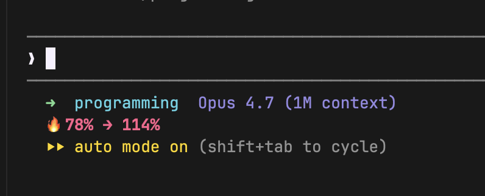

# claude-burn

Minimalist burn-rate indicator for **Claude Code**, designed for **Claude Max** subscribers who want to see — at a glance — how fast their current 5-hour block is being consumed, and whether they're on track to exceed it.

## Why

Claude Max meters usage in **rolling 5-hour blocks** (and a separate **rolling 7-day** window). The official UI surfaces these only after you hit a limit. `claude-burn` puts a one-line indicator in Claude Code's statusline that colours itself by projected end-of-block (and end-of-week) usage — quiet when you have headroom, loud when you're about to blow through.

No dollar amounts — you're paying a subscription, not per-token. The metric is % of your own calibrated ceiling.

## How it looks



```
Block: 15% → 32%                          # dim grey — quiet, plenty of headroom
Block: 45% → 74%                          # green    — normal
Block: 58% → 98% | Week: 41% → 88%        # yellow on the tighter half
Block: 72% → 148%                         # bold red — will exceed block limit
```

- **Block: X% → Y%** — current and projected % of the calibrated 5-hour block ceiling
- **Week: A% → B%** — same, for the 7-day window (only after `calibrate-weekly`)

Each segment is coloured independently by its own projection. Output is ANSI colour only — no emoji.

> **Weekly limits** (All models / Sonnet / Design) are separate Anthropic-side caps, partially invisible to local logs — webapp and mobile usage isn't captured by `ccusage`, so the weekly segment may run lower than what Claude's UI shows. Re-calibrate when they drift.
>
> The weekly window is a **rolling 7 days from your first prompt after the previous reset**, not tied to your subscription billing date. Practical consequence: if you bought the plan on Monday but didn't use Claude until Friday after the previous weekly reset, the next reset is Friday — not Monday. Don't assume your reset day is fixed.

> **A note on accuracy.** `ccusage` reconstructs the 5-hour window from your local Claude Code JSONL logs — so "when does this block reset" is a local estimate, not what the Claude server actually uses. That's why this tool **does not display a countdown**: open Claude's settings → Usage for the real reset time. The block % and projection, once calibrated, tend to match Claude's UI within a few points.

## Install

### Prerequisites

- [Claude Code](https://claude.com/claude-code)
- [`ccusage`](https://github.com/ryoppippi/ccusage) — `bun add -g ccusage` (or `npm i -g ccusage`)
- `jq`

### Install the binary

```sh
git clone https://github.com/uwilleer/claude-burn-rate.git
cd claude-burn-rate
./install.sh
```

Or manually:

```sh
install -m 0755 bin/claude-burn /usr/local/bin/claude-burn
```

### Wire it into Claude Code

Add to `~/.claude/settings.json`:

```json
{
  "statusLine": {
    "type": "command",
    "command": "claude-burn"
  }
}
```

Or, to **append** to an existing statusline script (recommended if you already have one), add this at the end of your script:

```sh
claude-burn
```

`claude-burn` prints exactly one line and exits.

## Calibration (important)

`ccusage` does not know your Claude Max plan's real block ceiling — it approximates with the **historical maximum** of your past blocks, which can drift from the real limit (if you ever used pay-per-use API, or your plan changed). The first time you install, the indicator may disagree with what Claude's UI shows.

**When to calibrate.** Both numbers Claude's UI gives you are integers — calibrating at `5% / 4h50m left` or `95% / 5min left` amplifies rounding error. Aim for the **middle of the block** (~40–60% used, ~2–3 hours left) so both inputs carry real signal. Same logic for the weekly window: ideally calibrate when your weekly usage is also mid-range, not right after a reset and not right before one. Mid-block + mid-week → tightest fit.

**Block calibration:**

1. Open Claude settings → Usage. Note **two** numbers for the current session:
   - percentage used (e.g. `57%`)
   - remaining time (e.g. `1 hr 26 min`)
2. Run:
   ```sh
   claude-burn calibrate 57 1h26m
   ```

   The duration accepts `1h26m`, `86m`, or a bare `86` (interpreted as minutes).

This writes the block token ceiling **and** the offset between ccusage's locally-reconstructed block end and Claude's real block end to `$BURN_CACHE_DIR/burn-limit`. Without the time offset, projections silently inflate (e.g. `block 25→180%` when you'd actually land at `106%`), because the projection formula multiplies your burn rate by how long is left in the block — and ccusage's idea of "how long" can be off by 1–2 hours.

Re-run calibration whenever the two numbers drift apart. You'll know it's time if the indicator's projection keeps going up even though the Claude UI says you'll easily make it to reset.

Alternative: if you know your plan's exact per-block token ceiling, set `BURN_BLOCK_LIMIT=<tokens>` in your environment. It takes precedence over the calibrated file.

**Weekly calibration (optional, enables the `Week:` segment):**

1. In Claude settings → Usage, note your weekly % used (the higher of the All-models / Sonnet / Design caps if you want the most conservative read).
2. Run:
   ```sh
   claude-burn calibrate-weekly 42
   # or pin the week-start date explicitly:
   claude-burn calibrate-weekly 42 2026-04-21
   ```

   With no date, the most recent Monday is assumed. Since the weekly reset day **isn't fixed to Monday** (see the note above), pass the actual reset date if you know it. The week start auto-advances by 7 days thereafter, no need to recalibrate every week.

   This writes `$BURN_CACHE_DIR/burn-weekly`. Remove that file to disable the `Week:` segment.

## Configuration

All knobs are environment variables.

| Variable | Default | Meaning |
|---|---|---|
| `BURN_CACHE_DIR` | `$HOME/.claude` | Where caches, history, and calibration files live |
| `BURN_MAX_AGE` | `15` | Block cache TTL in seconds (stale-while-revalidate) |
| `BURN_WEEKLY_MAX_AGE` | `60` | Weekly cache TTL in seconds |
| `BURN_BLOCK_LIMIT` | unset | Explicit block token limit. Overrides the calibrated file and ccusage's historical max. |
| `BURN_GREEN_MAX` | `60` | Upper bound of the dim/green band (% of ceiling) |
| `BURN_YELLOW_MAX` | `90` | Upper bound of the green band |
| `BURN_RED_MAX` | `110` | Upper bound of yellow; above this is bold red |
| `BURN_MODEL` | unset | If set, a second line prints `Current: <model> (<effort>) \| Recommend: <model>` based on the tighter of the two projections |
| `BURN_EFFORT` | unset | Effort label appended to `BURN_MODEL` (e.g. `high`) |

Bands apply to both block and week segments. Below `BURN_GREEN_MAX` is dim grey (quiet); above `BURN_RED_MAX` is bold red.

### Optional: model recommendation

If you export `BURN_MODEL` (and optionally `BURN_EFFORT`) from your statusline wrapper, `claude-burn` prints a second line suggesting whether to ease off Opus and drop to Sonnet/Haiku based on the worst of the block/week projections. Without `BURN_MODEL`, only the one-line indicator prints.

## How it works

1. Calls `ccusage blocks --json --active --offline --token-limit max` in the **background**, once per `BURN_MAX_AGE` seconds. Result is cached at `$BURN_CACHE_DIR/burn-cache.json`.
2. If weekly calibration exists, separately refreshes `ccusage blocks --json --offline` into `burn-weekly-cache.json` once per `BURN_WEEKLY_MAX_AGE` seconds and sums tokens since the (auto-advanced) week start.
3. Parses each into `current %` and projected end-of-window %, then prints one ANSI-coloured line.

Statusline invocations are **non-blocking**: the first call after a cache expires returns stale data immediately and kicks the refresh in the background.

### Files

All under `$BURN_CACHE_DIR`:

- `burn-cache.json` — cached active-block ccusage output
- `burn-history` — last ≤100 projection samples
- `burn-limit` — calibrated block ceiling + reset-time offset
- `burn-weekly-cache.json` — cached all-blocks ccusage output
- `burn-weekly` — calibrated weekly limit + week-start anchor

## Performance

- Each tick: 1 `jq` call, 1 `stat`, a couple of `printf`s — sub-millisecond.
- Background refresh: `ccusage blocks` takes ~10 s on a large log directory; it's backgrounded so it never blocks statusline rendering.
- No network calls (`--offline` uses cached pricing).

## Privacy

- Reads only local Claude Code JSONL logs (via `ccusage`)
- Writes only to `$BURN_CACHE_DIR` (cache + trend history)
- No telemetry, no network

## Compatibility

- macOS (`stat -f %m`) and Linux (`stat -c %Y`) — both supported
- POSIX `sh`

## License

MIT — see [LICENSE](LICENSE).
